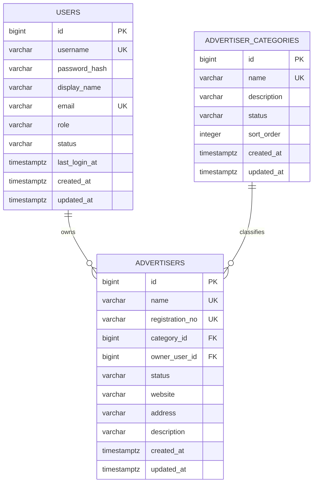

# Advertiser CRM 数据库设计（Sprint 1）

## 1. 设计范围

本阶段只设计用户认证、用户管理和广告主管理所需的三张核心表：

- `users`：系统用户、角色和账号状态。
- `advertiser_categories`：广告主分类。
- `advertisers`：广告主企业档案。

联系人、广告账户、投放计划、日报和报表相关表不进入本次迁移，待对应模块开发前继续设计。

## 2. 通用约定

| 项目 | 约定 |
| --- | --- |
| 数据库 | PostgreSQL 16，使用默认 `public` schema |
| 命名 | 表名、字段名和索引名统一使用 `snake_case` |
| 主键 | `BIGINT GENERATED BY DEFAULT AS IDENTITY` |
| 时间 | 使用 `TIMESTAMPTZ`，应用统一按 UTC 处理 |
| 状态 | 使用 `VARCHAR + CHECK`，避免 PostgreSQL ENUM 增加迁移成本 |
| 删除 | Sprint 1 不提供物理删除，使用 `status` 启用或禁用 |
| 密码 | 只保存 BCrypt 哈希，不保存明文密码 |
| 更新时间 | `created_at` 由数据库生成；`updated_at` 由应用在更新时维护 |

## 3. 表关系

说明：一个用户可以负责多个广告主，一个分类可以包含多个广告主；广告主在未分配负责人或分类时也允许先建档，因此两个外键可以为空。

## 4. `users`

### 4.1 用途

保存系统登录账号、密码摘要、角色、账号状态及基本资料。

### 4.2 字段

| 字段 | 类型 | 可空 | 默认值 | 说明 |
| --- | --- | --- | --- | --- |
| `id` | `BIGINT` | 否 | Identity | 主键 |
| `username` | `VARCHAR(50)` | 否 | - | 登录名；应用保存前转为小写并去除首尾空格 |
| `password_hash` | `VARCHAR(100)` | 否 | - | BCrypt 密码摘要 |
| `display_name` | `VARCHAR(100)` | 否 | - | 用户显示名称 |
| `email` | `VARCHAR(254)` | 是 | `NULL` | 邮箱；提供时不允许重复 |
| `role` | `VARCHAR(20)` | 否 | `OPERATOR` | `ADMIN` 或 `OPERATOR` |
| `status` | `VARCHAR(20)` | 否 | `ACTIVE` | `ACTIVE` 或 `DISABLED` |
| `last_login_at` | `TIMESTAMPTZ` | 是 | `NULL` | 最近一次成功登录时间 |
| `created_at` | `TIMESTAMPTZ` | 否 | `CURRENT_TIMESTAMP` | 创建时间 |
| `updated_at` | `TIMESTAMPTZ` | 否 | `CURRENT_TIMESTAMP` | 最近更新时间 |

### 4.3 约束与索引

- 主键：`pk_users (id)`。
- 用户名不区分大小写唯一：`uk_users_username_lower`，表达式为 `LOWER(username)`。
- 邮箱不区分大小写唯一：`uk_users_email_lower`，仅对非空邮箱生效。
- `username` 和 `display_name` 去除首尾空格后不能为空。
- `role` 只允许 `ADMIN`、`OPERATOR`。
- `status` 只允许 `ACTIVE`、`DISABLED`。
- 普通注册只能创建 `OPERATOR`；创建或修改 `ADMIN` 必须由管理员完成。这一条由业务层保证。

## 5. `advertiser_categories`

### 5.1 用途

管理广告主分类，例如电商、教育、游戏或其他业务分类。分类禁用后保留历史关联，但不能再分配给新广告主。

### 5.2 字段

| 字段 | 类型 | 可空 | 默认值 | 说明 |
| --- | --- | --- | --- | --- |
| `id` | `BIGINT` | 否 | Identity | 主键 |
| `name` | `VARCHAR(100)` | 否 | - | 广告主分类名称 |
| `description` | `VARCHAR(500)` | 是 | `NULL` | 分类说明 |
| `status` | `VARCHAR(20)` | 否 | `ACTIVE` | `ACTIVE` 或 `DISABLED` |
| `sort_order` | `INTEGER` | 否 | `0` | 展示顺序，数值越小越靠前 |
| `created_at` | `TIMESTAMPTZ` | 否 | `CURRENT_TIMESTAMP` | 创建时间 |
| `updated_at` | `TIMESTAMPTZ` | 否 | `CURRENT_TIMESTAMP` | 最近更新时间 |

### 5.3 约束与索引

- 主键：`pk_advertiser_categories (id)`。
- 广告主分类名称不区分大小写唯一：`uk_advertiser_categories_name_lower`。
- `name` 去除首尾空格后不能为空。
- `status` 只允许 `ACTIVE`、`DISABLED`。
- `sort_order` 必须大于等于 `0`。
- 列表排序索引：`idx_advertiser_categories_status_sort_order (status, sort_order)`。

## 6. `advertisers`

### 6.1 用途

保存广告主企业档案、分类、负责人和启用状态。联系人信息后续放入独立的 `contacts` 表，不在本表重复保存。

### 6.2 字段

| 字段 | 类型 | 可空 | 默认值 | 说明 |
| --- | --- | --- | --- | --- |
| `id` | `BIGINT` | 否 | Identity | 主键 |
| `name` | `VARCHAR(200)` | 否 | - | 企业名称 |
| `registration_no` | `VARCHAR(64)` | 是 | `NULL` | 统一社会信用代码或其他企业注册编号 |
| `category_id` | `BIGINT` | 是 | `NULL` | 广告主分类，关联 `advertiser_categories.id` |
| `owner_user_id` | `BIGINT` | 是 | `NULL` | 负责人，关联 `users.id` |
| `status` | `VARCHAR(20)` | 否 | `ACTIVE` | `ACTIVE` 或 `DISABLED` |
| `website` | `VARCHAR(255)` | 是 | `NULL` | 企业网站 |
| `address` | `VARCHAR(500)` | 是 | `NULL` | 企业地址 |
| `description` | `TEXT` | 是 | `NULL` | 企业备注或简介 |
| `created_at` | `TIMESTAMPTZ` | 否 | `CURRENT_TIMESTAMP` | 创建时间 |
| `updated_at` | `TIMESTAMPTZ` | 否 | `CURRENT_TIMESTAMP` | 最近更新时间 |

### 6.3 约束与索引

- 主键：`pk_advertisers (id)`。
- 企业名称不区分大小写唯一：`uk_advertisers_name_lower`。
- 注册编号唯一：`uk_advertisers_registration_no`，仅对非空值生效。
- `name` 去除首尾空格后不能为空。
- `status` 只允许 `ACTIVE`、`DISABLED`。
- 外键 `category_id` 指向 `advertiser_categories.id`，删除分类时设为 `NULL`。
- 外键 `owner_user_id` 指向 `users.id`，删除用户时设为 `NULL`。
- 查询索引：
  - `idx_advertisers_category_id (category_id)`
  - `idx_advertisers_owner_user_id (owner_user_id)`
  - `idx_advertisers_status (status)`

## 7. 关键业务规则

以下规则不适合完全依赖数据库约束，后续在 Service 层实现：

1. 用户注册时默认角色必须为 `OPERATOR`。
2. 禁用用户不能登录。
3. 至少保留一个可用的 `ADMIN`，不能禁用最后一个管理员。
4. 只能给广告主分配状态为 `ACTIVE` 的分类和负责人。
5. 分类或用户被禁用时，不自动修改已有广告主关系。
6. 企业名称和注册编号在写入前去除首尾空格；用户名和邮箱同时转为小写。
7. Sprint 1 不提供物理删除接口，状态变更使用 `PATCH`。

## 8. 本阶段验收条件

- 三张表的字段、类型、空值策略、默认值明确。
- 用户角色和各表状态具有数据库检查约束。
- 用户名、邮箱、广告主分类名称、广告主企业名称和注册编号具有正确的唯一性策略。
- 广告主与分类、负责人的关系明确，外键行为明确。
- 设计可以直接转换为一份可重复执行的 Flyway `V1` 迁移脚本。
