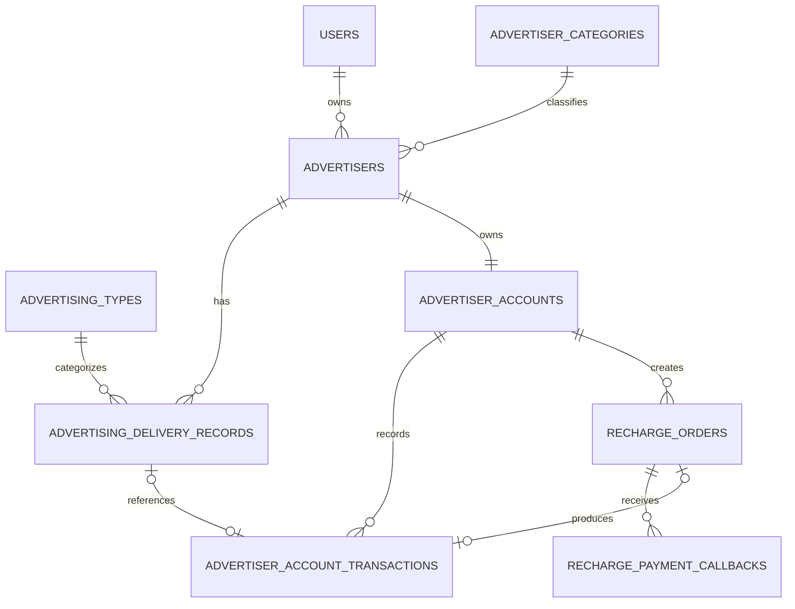

# Advertiser CRM Sprint 2 数据库设计

> 状态：板块 A 模块 1——设计基线
>
> 适用迁移：现有 `V1`、`V2` 之后的 `V3`～`V5`
>
> 本文先固定命名、关系和约束；具体建表 SQL 在后续模块中实现并以自动化测试验证

## 1. 设计目标

Sprint 2 在现有用户、广告主分类和广告主档案之上增加广告投放、账户流水和模拟充值能力。数据库设计需要保证：

- 投放数据可以按日期、广告主和广告类型查询、聚合。
- 当前余额可以快速查询，所有余额变化都有不可变流水。
- 重复投放数据、重复消费和重复支付回调不能重复入账。
- 金额、状态、漏斗指标和唯一性不仅在 Java 中校验，也由 PostgreSQL 约束保护。
- 业务历史不会因为删除广告主或字典记录而被级联删除。
- 新迁移同时支持空数据库初始化和现有 Sprint 1 数据库升级。

## 2. 现有数据库基线

当前业务表如下：

| 表 | 职责 | Sprint 2 复用方式 |
| --- | --- | --- |
| `users` | 内部用户、登录角色和账号状态 | 作为广告主负责人和资金操作人 |
| `advertiser_categories` | 广告主所属行业分类 | 保持原职责，不作为广告形式字典 |
| `advertisers` | 广告主企业档案 | 作为投放、账户和充值业务的聚合根 |

当前关系：

- `advertisers.category_id -> advertiser_categories.id`，删除分类时置空。
- `advertisers.owner_user_id -> users.id`，删除负责人时置空。
- 已执行的 `V1`、`V2` 不再修改。

## 3. 命名规范

### 3.1 数据库与 Java 命名

- 数据库表使用完整英文单词、复数和 `snake_case`，与现有 `users`、`advertisers` 保持一致。
- 数据库列使用 `snake_case`。
- Java 实体使用单数 `PascalCase`。
- 不使用含义容易混淆的 `ad` 缩写，统一使用 `advertising`。
- 数据库业务编号继续使用项目已有的 `_no` 风格，例如 `registration_no`、`order_no`、`business_no`。

最终命名：

| 数据库表 | Java 实体 | 职责 |
| --- | --- | --- |
| `advertising_types` | `AdvertisingType` | 广告形式字典 |
| `advertising_delivery_records` | `AdvertisingDeliveryRecord` | 每日投放事实记录 |
| `advertiser_accounts` | `AdvertiserAccount` | 广告主当前账户余额 |
| `advertiser_account_transactions` | `AdvertiserAccountTransaction` | 不可变充值/消费流水 |
| `recharge_orders` | `RechargeOrder` | 模拟充值订单及状态机 |
| `recharge_payment_callbacks` | `RechargePaymentCallback` | 支付回调审计和幂等记录 |

主要外键字段同步使用完整名称：

| 字段 | 含义 |
| --- | --- |
| `advertising_type_id` | 广告类型 ID |
| `advertising_delivery_record_id` | 可选的投放记录 ID |
| `advertiser_account_id` | 广告主账户 ID |
| `recharge_order_id` | 充值订单 ID |

### 3.2 编号的职责

| 编号 | 所在表 | 用途 |
| --- | --- | --- |
| `external_record_no` | `advertising_delivery_records` | 防止同一外部投放记录重复入库 |
| `business_no` | `advertiser_account_transactions` | 唯一标识一次资金变更，防止重复扣款或充值 |
| `order_no` | `recharge_orders` | 唯一标识一笔充值订单 |
| `provider_event_id` | `recharge_payment_callbacks` | 唯一标识支付方回调事件，防止重复处理 |

这些编号与数据库自增主键 `id` 的职责不同：`id` 用于内部关联，业务编号用于跨请求追踪和幂等。

## 4. ER 关系



关系说明：

- 一个广告主可以有多条投放记录。
- 一个广告类型可以出现在多条投放记录中。
- 一个广告主必须且只能有一个资金账户。
- 一个账户可以有多条不可变资金流水和多笔充值订单。
- 一笔充值订单可能收到多次回调，但只允许生成一笔充值流水。
- 一笔消费流水可以显式关联一条投放记录；录入或修正投放数据不会隐式扣款。

## 5. 表设计

## 5.1 `advertising_types`

广告形式字典，与表示广告主行业的 `advertiser_categories` 分开。

建议字段：

| 字段 | 类型 | 规则 |
| --- | --- | --- |
| `id` | `BIGINT` | 自增主键 |
| `code` | `VARCHAR(30)` | 非空，不区分大小写唯一 |
| `name` | `VARCHAR(100)` | 非空、非空白 |
| `status` | `VARCHAR(20)` | `ACTIVE`、`DISABLED` |
| `created_at` | `TIMESTAMPTZ` | 非空 |
| `updated_at` | `TIMESTAMPTZ` | 非空 |

预置 `SEARCH`、`DISPLAY`、`VIDEO`、`SOCIAL`。禁用类型保留历史关系，但不能用于新投放数据。

## 5.2 `advertising_delivery_records`

保存用于统计的投放事实。Sprint 2 的一行表示“一条有唯一外部编号、归属于某广告主和广告类型、发生在某业务日期的投放数据”。同一广告主、广告类型和日期允许存在多条不同来源记录，避免错误限制未来批次或渠道导入。

建议字段：

| 字段 | 类型 | 规则 |
| --- | --- | --- |
| `id` | `BIGINT` | 自增主键 |
| `external_record_no` | `VARCHAR(64)` | 非空、全局唯一、非空白 |
| `advertiser_id` | `BIGINT` | 非空，关联 `advertisers` |
| `advertising_type_id` | `BIGINT` | 非空，关联 `advertising_types` |
| `record_date` | `DATE` | 非空，使用 Java `LocalDate` |
| `impressions` | `BIGINT` | 非空且 `>= 0` |
| `clicks` | `BIGINT` | 非空且 `0 <= clicks <= impressions` |
| `conversions` | `BIGINT` | 非空且 `0 <= conversions <= clicks` |
| `spend` | `NUMERIC(19,2)` | 非空且 `>= 0` |
| `created_at` | `TIMESTAMPTZ` | 非空 |
| `updated_at` | `TIMESTAMPTZ` | 非空 |

初始查询索引候选：

- 唯一索引：`external_record_no`。
- 日期范围：`record_date`。
- 广告主时间范围：`(advertiser_id, record_date)`。
- 广告类型时间范围：`(advertising_type_id, record_date)`。

最终索引需要在报表 SQL 完成后用足量模拟数据和 `EXPLAIN ANALYZE` 验证。

## 5.3 `advertiser_accounts`

保存账户当前余额，不承担历史审计职责。

建议字段：

| 字段 | 类型 | 规则 |
| --- | --- | --- |
| `id` | `BIGINT` | 自增主键 |
| `advertiser_id` | `BIGINT` | 非空且唯一，关联 `advertisers` |
| `balance` | `NUMERIC(19,2)` | 非空、默认 `0.00`、不得小于 0 |
| `created_at` | `TIMESTAMPTZ` | 非空 |
| `updated_at` | `TIMESTAMPTZ` | 非空 |

账户生命周期：

- `V4` 为现有广告主补建零余额账户。
- 后续创建广告主时，在同一事务内创建零余额账户。
- 不在余额查询等 `GET` 请求中隐式创建账户。
- 删除没有任何业务历史的广告主时可以一并删除空账户。
- 存在投放、流水或充值历史时，Service 主动返回 `409 ADVERTISER_HAS_BUSINESS_DATA`。

## 5.4 `advertiser_account_transactions`

保存每一次余额变化。流水只追加，不提供修改和删除接口。

建议字段：

| 字段 | 类型 | 规则 |
| --- | --- | --- |
| `id` | `BIGINT` | 自增主键 |
| `advertiser_account_id` | `BIGINT` | 非空，关联 `advertiser_accounts` |
| `business_no` | `VARCHAR(64)` | 非空、全局唯一、非空白 |
| `transaction_type` | `VARCHAR(30)` | `RECHARGE`、`CONSUMPTION` |
| `amount` | `NUMERIC(19,2)` | 始终为正数 |
| `balance_after` | `NUMERIC(19,2)` | 不得小于 0 |
| `advertising_delivery_record_id` | `BIGINT` | 消费时可选关联投放记录 |
| `recharge_order_id` | `BIGINT` | 充值时可选关联充值订单，由 `V5` 添加外键 |
| `remark` | `VARCHAR(500)` | 可空 |
| `created_by` | `BIGINT` | 可空，关联内部操作用户 |
| `created_at` | `TIMESTAMPTZ` | 非空，流水不设置 `updated_at` |

金额始终保存正数，由 `transaction_type` 表达方向：

- `RECHARGE`：账户增加 `amount`。
- `CONSUMPTION`：账户减少 `amount`。

余额更新和流水插入必须位于同一事务。消费使用带 `balance >= amount` 条件的原子更新，不能采用“先查余额、再无条件更新”的方式。

## 5.5 `recharge_orders`

保存一次模拟充值的支付过程，支付未成功时不会产生资金流水。

建议字段：

| 字段 | 类型 | 规则 |
| --- | --- | --- |
| `id` | `BIGINT` | 自增主键 |
| `order_no` | `VARCHAR(64)` | 非空、全局唯一、非空白 |
| `advertiser_account_id` | `BIGINT` | 非空，关联 `advertiser_accounts` |
| `amount` | `NUMERIC(19,2)` | 必须大于 0 |
| `status` | `VARCHAR(20)` | `PENDING`、`SUCCESS`、`FAILED`、`CLOSED` |
| `provider_transaction_no` | `VARCHAR(100)` | 可空，支付成功后记录 |
| `paid_at` | `TIMESTAMPTZ` | 可空 |
| `created_at` | `TIMESTAMPTZ` | 非空 |
| `updated_at` | `TIMESTAMPTZ` | 非空 |

合法状态迁移：

```text
PENDING -> SUCCESS
PENDING -> FAILED
PENDING -> CLOSED
```

终态不能回退。一笔成功订单最多对应一笔 `RECHARGE` 资金流水，`recharge_order_id` 需要唯一约束或等价的幂等保护。

## 5.6 `recharge_payment_callbacks`

保存支付平台通知的接收和处理结果，主要用于审计与幂等。

建议字段：

| 字段 | 类型 | 规则 |
| --- | --- | --- |
| `id` | `BIGINT` | 自增主键 |
| `provider_event_id` | `VARCHAR(100)` | 非空、全局唯一、非空白 |
| `recharge_order_id` | `BIGINT` | 非空，关联 `recharge_orders` |
| `callback_status` | `VARCHAR(20)` | `RECEIVED`、`PROCESSED`、`DUPLICATE`、`REJECTED` |
| `payload_hash` | `VARCHAR(64)` | 保存摘要，不保存密钥或敏感原始载荷 |
| `failure_reason` | `VARCHAR(500)` | 可空，客户端安全描述 |
| `received_at` | `TIMESTAMPTZ` | 非空 |
| `processed_at` | `TIMESTAMPTZ` | 可空 |

相同 `provider_event_id` 的通知只能成功处理一次。订单更新、余额增加、充值流水写入和回调处理状态更新必须在同一事务中完成。

## 6. 删除和历史保留策略

| 被删除对象 | 策略 |
| --- | --- |
| 内部用户 | 保持 Sprint 1 行为，广告主负责人置空；流水 `created_by` 可置空 |
| 广告主分类 | 保持 Sprint 1 行为，广告主分类置空 |
| 广告类型 | 有历史投放时禁止删除，使用 `DISABLED` |
| 广告主 | 无业务历史时允许删除；有投放、流水或充值历史时返回 409，使用 `DISABLED` |
| 投放记录 | 未结算的误录数据可删除；已被消费流水引用时禁止删除 |
| 账户流水 | 永不物理修改或删除 |
| 充值订单和回调 | 保留审计历史，不级联删除 |

历史表的外键不得使用会删除业务历史的 `ON DELETE CASCADE`。空账户作为广告主的扩展数据可以由 Service 显式删除，避免数据库返回难以理解的外键错误。

## 7. 一致性和幂等边界

### 7.1 投放入库

`external_record_no` 是投放写入的幂等键。相同编号重复提交不得创建第二条记录。

### 7.2 消费

`business_no` 是消费请求的幂等键。一次事务内执行：

1. 检查或依靠唯一约束确认业务号未处理。
2. 使用余额条件原子扣款。
3. 插入 `CONSUMPTION` 流水并保存 `balance_after`。

### 7.3 充值回调

使用三层保护：

1. `provider_event_id` 防止同一回调事件重复处理。
2. 订单终态防止同一订单重复成功。
3. 充值流水 `business_no` 和 `recharge_order_id` 防止重复记账。

一次事务内完成订单成功、账户加款、充值流水和回调处理结果；任一步失败全部回滚。

## 8. 迁移顺序

```text
V1__create_core_tables.sql
V2__allow_pending_user_status.sql
V3__create_advertising_tables.sql
V4__create_advertiser_account_tables.sql
V5__create_recharge_payment_tables.sql
```

### `V3`

- 创建 `advertising_types`。
- 插入预置广告类型。
- 创建 `advertising_delivery_records`。
- 添加投放约束和初始查询索引。

### `V4`

- 创建 `advertiser_accounts`。
- 为已有广告主补建零余额账户。
- 创建 `advertiser_account_transactions`。
- 添加账户、金额、业务号和流水查询约束/索引。

### `V5`

- 创建 `recharge_orders`。
- 创建 `recharge_payment_callbacks`。
- 为资金流水增加 `recharge_order_id` 关联和唯一性保护。
- 添加订单号、回调事件号、状态和查询索引。

每个迁移文件一经执行不得修改。后续修正通过新版本迁移完成。

## 9. Java 模块边界

```text
delivery/
├── entity/
│   ├── AdvertisingType.java
│   ├── AdvertisingTypeStatus.java
│   └── AdvertisingDeliveryRecord.java
└── mapper/
    ├── AdvertisingTypeMapper.java
    └── AdvertisingDeliveryRecordMapper.java

account/
├── entity/
│   ├── AdvertiserAccount.java
│   ├── AdvertiserAccountTransaction.java
│   └── AccountTransactionType.java
└── mapper/
    ├── AdvertiserAccountMapper.java
    └── AdvertiserAccountTransactionMapper.java

payment/
├── entity/
│   ├── RechargeOrder.java
│   ├── RechargeOrderStatus.java
│   ├── RechargePaymentCallback.java
│   └── PaymentCallbackStatus.java
└── mapper/
    ├── RechargeOrderMapper.java
    └── RechargePaymentCallbackMapper.java
```

模块 1 只固定以上边界，不提前建立空包。实体、Mapper 和迁移将在对应后续模块一起增加。

## 10. 板块 A 验收基线

后续模块全部完成后需要验证：

- 空数据库能连续执行 `V1`～`V5`。
- 现有 `V2` 数据库能无损升级到 `V5`。
- 6 张新表、外键、检查约束和唯一索引存在。
- 现有广告主全部获得零余额账户。
- 新广告主创建时同步获得账户。
- 非法指标、负余额、非正金额和非法状态被数据库拒绝。
- 4 类业务编号均能阻止对应的重复操作。
- 存在业务历史的广告主不能物理删除。
- Java 实体字段和数据库列一一对应。
- Sprint 1 全量测试仍然通过。
